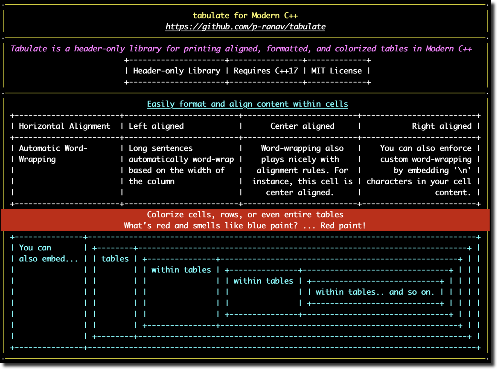

<p align="center">
    
</p>

<p align="center">
    
</p>

```
·─────────────────────────────────────────────────────────────────────────────────────────────────────────·
│                                         tabulate for Modern C++                                         │
│                                   https://github.com/p-ranav/tabulate                                   │
·─────────────────────────────────────────────────────────────────────────────────────────────────────────·
│ Tabulate is a header-only library for printing aligned, formatted, and colorized tables in Modern C++   │
│                          +---------------------+----------------+-------------+                         │
│                          | Header-only Library | Requires C++17 | MIT License |                         │
│                          +---------------------+----------------+-------------+                         │
·─────────────────────────────────────────────────────────────────────────────────────────────────────────·
│                               Easily format and align content within cells                              │
│ +-----------------------+-------------------------+-------------------------+-------------------------+ │
│ | Horizontal Alignment  | Left aligned            |      Center aligned     |           Right aligned | │
│ +-----------------------+-------------------------+-------------------------+-------------------------+ │
│ | Automatic Word-       | Long sentences          |    Word-wrapping also   |    You can also enforce | │
│ | Wrapping              | automatically word-wrap |    plays nicely with    |    custom word-wrapping | │
│ |                       | based on the width of   |   alignment rules. For  |       by embedding '\n' | │
│ |                       | the column              |  instance, this cell is | characters in your cell | │
│ |                       |                         |     center aligned.     |                content. | │
│ +-----------------------+-------------------------+-------------------------+-------------------------+ │
│                               Colorize cells, rows, or even entire tables                               │
│                          What's red and smells like blue paint? ... Red paint!                          │
: +---------------+-------------------------------------------------------------------------------------+ :
: % You can       \ +--------+------------------------------------------------------------------------+ % :
: % also embed... \ | tables | +---------------+----------------------------------------------------+ | % :
: %               \ |        | | within tables | +---------------+--------------------------------+ | | % :
: %               \ |        | |               | | within tables | +----------------------------+ | | | % :
: %               \ |        | |               | |               | | within tables.. and so on. | | | | % :
: %               \ |        | |               | |               | +----------------------------+ | | | % :
: %               \ |        | |               | +---------------+--------------------------------+ | | % :
: %               \ |        | +---------------+----------------------------------------------------+ | % :
: %               \ +--------+------------------------------------------------------------------------+ % :
: +---------------+-------------------------------------------------------------------------------------+ :
·─────────────────────────────────────────────────────────────────────────────────────────────────────────·
```
