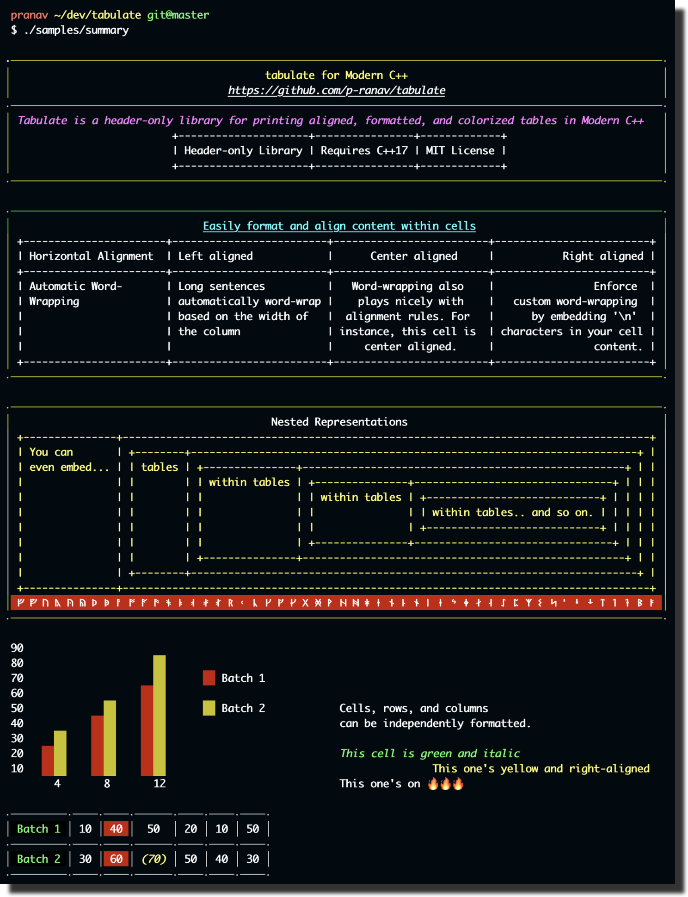
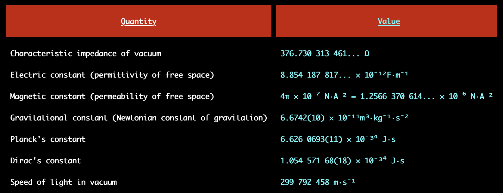
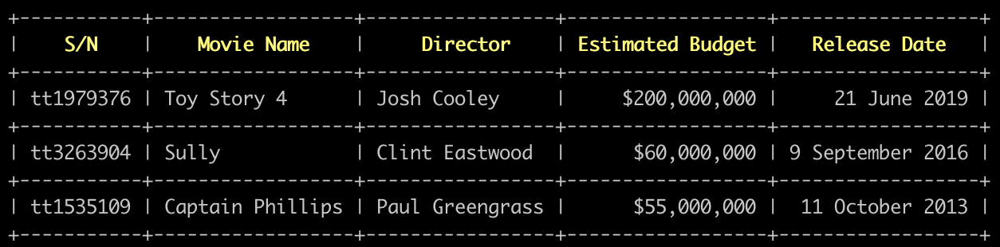
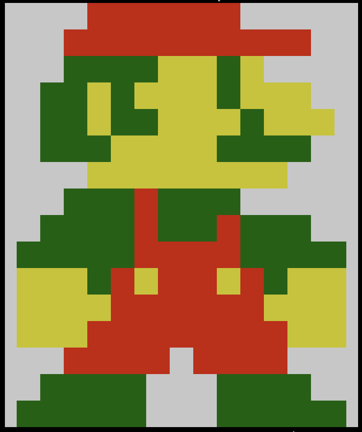

<p align="center">
    
</p>

<p align="center">
    
  <p align="center">
   Source for the above image can be found
    <a href="https://github.com/p-ranav/tabulate/blob/master/samples/summary.cpp">
      here
    </a>
  </p>
</p>

# Table of Contents

* [Quick Start](#quick-start)
* [Formatting Tables](#formatting-tables)
  - [Inheritance Model in Table Formatting](#inheritance-model-in-table-formatting)
  - [Font Alignment](#font-alignment)
  - [Coloring Cells](#coloring-cells)
* [Contributing](#contributing)
* [License](#license)

# Quick Start

`tabulate` is a header-only library. Just add `include/` to your `include_directories` and you should be good to go. 

## Adding rows

Create a `Table` object and call `Table.add_rows` to add rows to your table. `tabulate` will use the length of the first row as the number of columns in the table.

```cpp
#include <tabulate/table.hpp>
using namespace tabulate;

int main() {

  Table universal_constants;

  universal_constants.add_row({"Quantity", "Value"});
  universal_constants.add_row({"Characteristic impedance of vacuum", "376.730 313 461... Ω"});
  universal_constants.add_row({"Electric constant (permittivity of free space)", "8.854 187 817... × 10⁻¹²F·m⁻¹"});
  universal_constants.add_row({"Magnetic constant (permeability of free space)", "4π × 10⁻⁷ N·A⁻² = 1.2566 370 614... × 10⁻⁶ N·A⁻²"});
  universal_constants.add_row({"Gravitational constant (Newtonian constant of gravitation)", "6.6742(10) × 10⁻¹¹m³·kg⁻¹·s⁻²"});
  universal_constants.add_row({"Planck's constant", "6.626 0693(11) × 10⁻³⁴ J·s"});
  universal_constants.add_row({"Dirac's constant", "1.054 571 68(18) × 10⁻³⁴ J·s"});
  universal_constants.add_row({"Speed of light in vacuum", "299 792 458 m·s⁻¹"});
```

## Formatting the table

You can format this table using `Table.format()` which returns a `Format` object. Using a fluent interface, format properties of the table, e.g., borders, font styles, colors etc.

```cpp
  universal_constants.format()
    .font_style({FontStyle::bold})
    .border_top(" ")
    .border_bottom(" ")
    .border_left(" ")
    .border_right(" ")
    .corner(" ");
```

## Formatting rows

You can access rows in the table using `Table[row_index]`. This will return a `Row` object on which you can similarly call `Row.format()` to format properties of all the cells in that row.

Now, let's format the header of the table. The following code changes the font background of the header row to `red`, aligns the cell contents to `center` and applied a padding to the top and bottom of the row.

```cpp
  universal_constants[0].format()
    .padding_top(1)
    .padding_bottom(1)
    .font_align(FontAlign::center)
    .font_style({FontStyle::underline})
    .font_background_color(Color::red);
```

## Formatting columns

Calling `Table.column(index)` will return a `Column` object. Similar to rows, you can use `Column.format()` to format all the cells in that column.

Now, let's change the font color of the second column to yellow:

```cpp
  universal_constants.column(1).format()
    .font_color(Color::yellow);
```

## Formatting cells

You can access cells by indexing twice from a table using: From a row using `Table[row_index][col_index]` or from a column using `Table.column(col_index)[cell_index]`. Just like rows, columns, and tables, you can use `Cell.format()` to format individual cells

```cpp
  universal_constants[0][1].format()
    .font_background_color(Color::blue)
    .font_color(Color::white);
}
```

## Printing the table

Print the table using the stream `operator<<` like so:

```cpp
  std::cout << universal_constants << std::endl;
``` 

You could also use `Table.print(stream)` to print the table, e.g., `universal_constants.print(std::cout)`. 

<p align="center">
    
</p>

# Formatting Tables

## Inheritance Model in Table Formatting

Formatting in `tabulate` follows this simple inheritance model. When rendering each cell:
1. Apply cell formatting if specified
2. If no cell formatting is specified, apply its parent row formatting
3. If no row formatting is specified, apply its parent table formatting
4. If no table formatting is specified, apply the default table formatting

This enables overriding the formatting for a particular cell even though row or table formatting is specified, e.g., when an entire row is colored `yellow` but you want a specific cell to be colored `red`.

## Font Alignment

`tabulate` supports three font alignment settings: `left`, `center`, and `right`. By default, all table content is left-aligned. To align cells, use `.format().font_align(alignment)`. 

```cpp
#include <tabulate/table.hpp>
using namespace tabulate;

int main() {
  Table movies;
  movies.add_row({"S/N", "Movie Name", "Director", "Estimated Budget", "Release Date"});
  movies.add_row({"tt1979376", "Toy Story 4", "Josh Cooley", "$200,000,000", "21 June 2019"});
  movies.add_row({"tt3263904", "Sully", "Clint Eastwood", "$60,000,000", "9 September 2016"});
  movies.add_row({"tt1535109", "Captain Phillips", "Paul Greengrass", "$55,000,000", " 11 October 2013"});

  // center align 'Director' column
  movies.column(2).format()
    .font_align(FontAlign::center);

  // right align 'Estimated Budget' column
  movies.column(3).format()
    .font_align(FontAlign::right);

  // right align 'Release Date' column
  movies.column(4).format()
    .font_align(FontAlign::right);

  // center-align and color header cells
  for (size_t i = 0; i < 5; ++i) {
    movies[0][i].format()
      .font_color(Color::yellow)
      .font_align(FontAlign::center)
      .font_style({FontStyle::bold});
  }

  std::cout << movies << std::endl;
}
```

<p align="center">
    
</p>

## Coloring Cells

There are a number of methods in the `Format` object to color cells - foreground and background for font, borders, corners, and column separators. 

Here's mario colored using `tabulate` on a `16x30` grid. You can check out the source for this table [here](https://github.com/p-ranav/tabulate/blob/master/samples/mario.cpp).

<p align="center">
    
</p>

Here's a snippet of the mario code to illustrate coloring:

```cpp
    // [...]
    
    // Row 15
    for (size_t i = 1; i < 12; ++i) {
      mario[15][i].format()
        .color(Color::green)
        .font_style({FontStyle::dark});
    }
    for (size_t i = 18; i < 29; ++i) {
      mario[15][i].format()
        .color(Color::green)
        .font_style({FontStyle::dark});
    }
```

## Contributing
Contributions are welcome, have a look at the [CONTRIBUTING.md](CONTRIBUTING.md) document for more information.

## License
The project is available under the [MIT](https://opensource.org/licenses/MIT) license.
